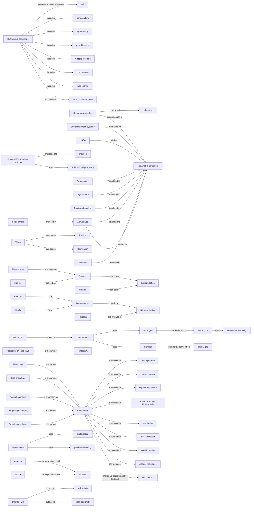

# Knowledge Graph for URL 1

**Source:** https://en.wikipedia.org/wiki/Sustainable_agriculture

**Status:**  Successfully Processed

**Entities Extracted:** 89

**Relations Found:** 217

```mermaid
flowchart LR
    Sustainable_agriculture["Sustainable agriculture"] -->|prevents adverse effects on| soil["soil"]
    Sustainable_agriculture["Sustainable agriculture"] -->|includes| permaculture["permaculture"]
    Sustainable_agriculture["Sustainable agriculture"] -->|includes| agroforestry["agroforestry"]
    Sustainable_agriculture["Sustainable agriculture"] -->|includes| mixed_farming["mixed farming"]
    Sustainable_agriculture["Sustainable agriculture"] -->|includes| multiple_cropping["multiple cropping"]
    Sustainable_agriculture["Sustainable agriculture"] -->|includes| crop_rotation["crop rotation"]
    Sustainable_agriculture["Sustainable agriculture"] -->|includes| land_sparing["land sparing"]
    Sustainable_agriculture["Sustainable agriculture"] -->|is considered| reconciliation_ecology["reconciliation ecology"]
    Shade_grown_coffee["Shade-grown coffee"] -->|is a form of| polyculture["polyculture"]
    Shade_grown_coffee["Shade-grown coffee"] -->|is an example of| sustainable_agriculture["sustainable agriculture"]
    Sustainable_food_systems["Sustainable food systems"] -->|are based on| sustainable_agriculture["sustainable agriculture"]
    USDA["USDA"] -->|defined| sustainable_agriculture["sustainable agriculture"]
    AI_controlled_irrigation_systems["AI-controlled irrigation systems"] -->|are related to| Irrigation["Irrigation"]
    AI_controlled_irrigation_systems["AI-controlled irrigation systems"] -->|use| Artificial_intelligence_AI["Artificial intelligence (AI)"]
    Agroecology["Agroecology"] -->|is related to| sustainable_agriculture["sustainable agriculture"]
    Digitalization["Digitalization"] -->|is related to| sustainable_agriculture["sustainable agriculture"]
    Precision_breeding["Precision breeding"] -->|is related to| sustainable_agriculture["sustainable agriculture"]
    Agrivoltaics["Agrivoltaics"] -->|is related to| sustainable_agriculture["sustainable agriculture"]
    Solar_panels["Solar panels"] -->|are used in| Agrivoltaics["Agrivoltaics"]
    Tilling["Tilling"] -->|can cause| Erosion["Erosion"]
    Tilling["Tilling"] -->|can cause| Salinization["Salinization"]
    Natural_gas["Natural gas"] -->|is used in| Haber_process["Haber process"]
    Mineral_ores["Mineral ores"] -->|are source of| Fertilizer["Fertilizer"]
    Fertilizer["Fertilizer"] -->|can cause| Eutrophication["Eutrophication"]
    Manure["Manure"] -->|is used as| Fertilizer["Fertilizer"]
    Nitrates["Nitrates"] -->|can cause| Eutrophication["Eutrophication"]
    Legume_crops["Legume crops"] -->|perform| Nitrogen_fixation["Nitrogen fixation"]
    Peanuts["Peanuts"] -->|are| Legume_crops["Legume crops"]
    Alfalfa["Alfalfa"] -->|are| Legume_crops["Legume crops"]
    Rhizobia["Rhizobia"] -->|are involved in| Nitrogen_fixation["Nitrogen fixation"]
    Haber_process["Haber process"] -->|uses| Hydrogen["Hydrogen"]
    Hydrogen["Hydrogen"] -->|is produced by| Electrolysis["Electrolysis"]
    Electrolysis["Electrolysis"] -->|uses| Renewable_electricity["Renewable electricity"]
    Phosphate["Phosphate"] -->|is a form of| Phosphorus["Phosphorus"]
    Rock_phosphate["Rock phosphate"] -->|is a source of| Phosphorus["Phosphorus"]
    Peak_phosphorus["Peak phosphorus"] -->|is a concern for| Phosphorus["Phosphorus"]
    Potassium_chloride_KCl["Potassium chloride (KCl)"] -->|is a source of| Potassium["Potassium"]
    Landraces["Landraces"] -->|are used in| sustainable_agriculture["sustainable agriculture"]
    Inorganic_phosphorus["Inorganic phosphorus"] -->|is a form of| Phosphorus["Phosphorus"]
    Organic_phosphorus["Organic phosphorus"] -->|is a form of| Phosphorus["Phosphorus"]
    agroecology["agroecology"] -->|uses| digitalization["digitalization"]
    agroecology["agroecology"] -->|uses| precision_breeding["precision breeding"]
    Agrivoltaics["Agrivoltaics"] -->|enhances| sustainable_agriculture["sustainable agriculture"]
    peanuts["peanuts"] -->|form symbioses with| rhizobia["rhizobia"]
    alfalfa["alfalfa"] -->|form symbioses with| rhizobia["rhizobia"]
    Haber_process["Haber process"] -->|uses| hydrogen["hydrogen"]
    hydrogen["hydrogen"] -->|is currently derived from| natural_gas["natural gas"]
    Phosphorus["Phosphorus"] -->|is involved in| photosynthesis["photosynthesis"]
    Phosphorus["Phosphorus"] -->|is involved in| energy_transfer["energy transfer"]
    Phosphorus["Phosphorus"] -->|is involved in| signal_transduction["signal transduction"]
    Phosphorus["Phosphorus"] -->|is involved in| macromolecular_biosynthesis["macromolecular biosynthesis"]
    Phosphorus["Phosphorus"] -->|is involved in| respiration["respiration"]
    Phosphorus["Phosphorus"] -->|is needed for| root_ramification["root ramification"]
    Phosphorus["Phosphorus"] -->|is needed for| seed_formation["seed formation"]
    Phosphorus["Phosphorus"] -->|can increase| disease_resistance["disease resistance"]
    Phosphorus["Phosphorus"] -->|makes up approximately 0.05% of| soil_biomass["soil biomass"]
    chloride_Clˉ["chloride (Clˉ)"] -->|increases| soil_salinity["soil salinity"]
    chloride_Clˉ["chloride (Clˉ)"] -->|puts at risk| soil_biodiversity["soil biodiversity"]
```
