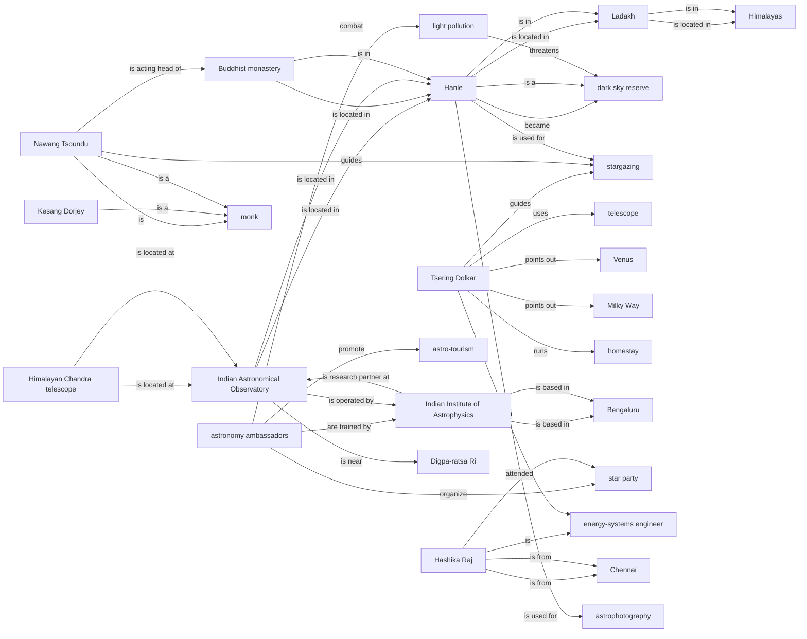

# Knowledge Graph for URL 10

**Source:** https://www.theguardian.com/global-development/2025/oct/13/astro-ambassadors-stargazers-himalayas-hanle-ladakh-india

**Status:**  Successfully Processed

**Entities Extracted:** 33

**Relations Found:** 99

