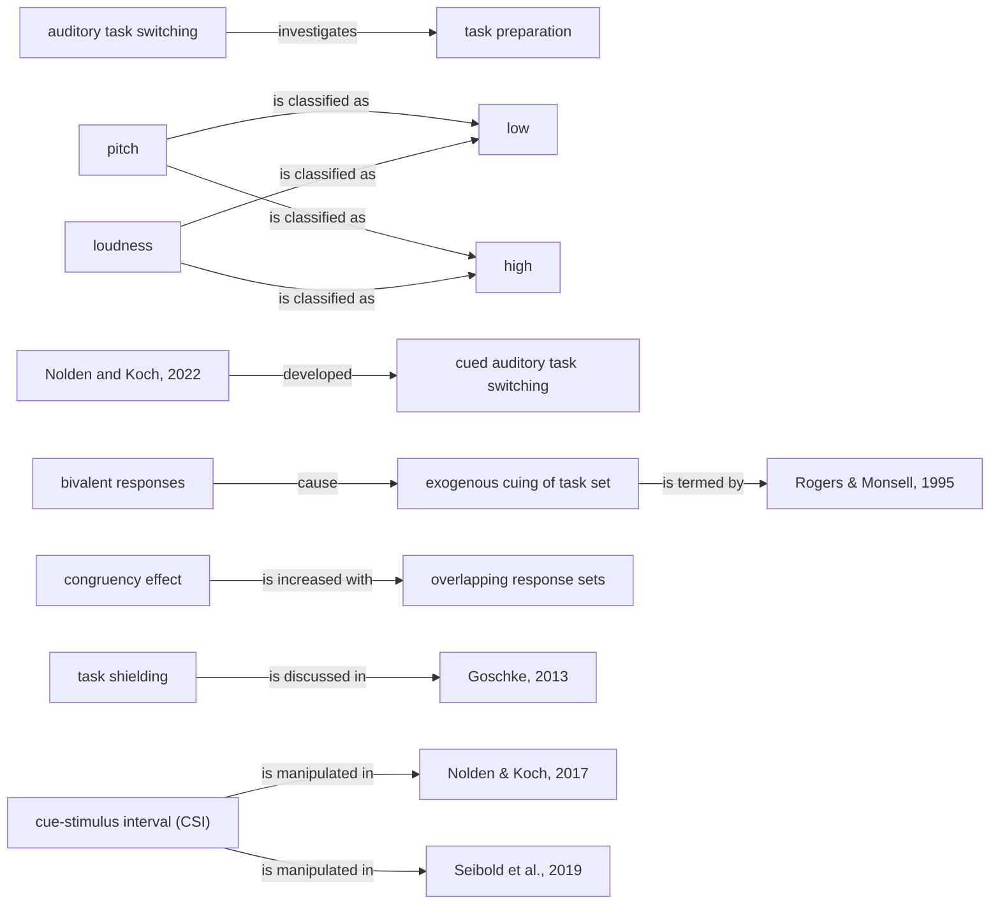

# Knowledge Graph for URL 4

**Source:** https://www.ncbi.nlm.nih.gov/pmc/articles/PMC10457221/

**Status:**  Successfully Processed

**Entities Extracted:** 42

**Relations Found:** 95

```mermaid
flowchart LR
    auditory_task_switching["auditory task switching"] -->|investigates| task_preparation["task preparation"]
    pitch["pitch"] -->|is classified as| low["low"]
    pitch["pitch"] -->|is classified as| high["high"]
    loudness["loudness"] -->|is classified as| low["low"]
    loudness["loudness"] -->|is classified as| high["high"]
    Nolden_and_Koch,_2022["Nolden and Koch, 2022"] -->|developed| cued_auditory_task_switching["cued auditory task switching"]
    bivalent_responses["bivalent responses"] -->|cause| exogenous_cuing_of_task_set["exogenous cuing of task set"]
    exogenous_cuing_of_task_set["exogenous cuing of task set"] -->|is termed by| Rogers_&_Monsell,_1995["Rogers & Monsell, 1995"]
    congruency_effect["congruency effect"] -->|is increased with| overlapping_response_sets["overlapping response sets"]
    task_shielding["task shielding"] -->|is discussed in| Goschke,_2013["Goschke, 2013"]
    cue_stimulus_interval_CSI["cue-stimulus interval (CSI)"] -->|is manipulated in| Nolden_&_Koch,_2017["Nolden & Koch, 2017"]
    cue_stimulus_interval_CSI["cue-stimulus interval (CSI)"] -->|is manipulated in| Seibold_et_al.,_2019["Seibold et al., 2019"]
```
