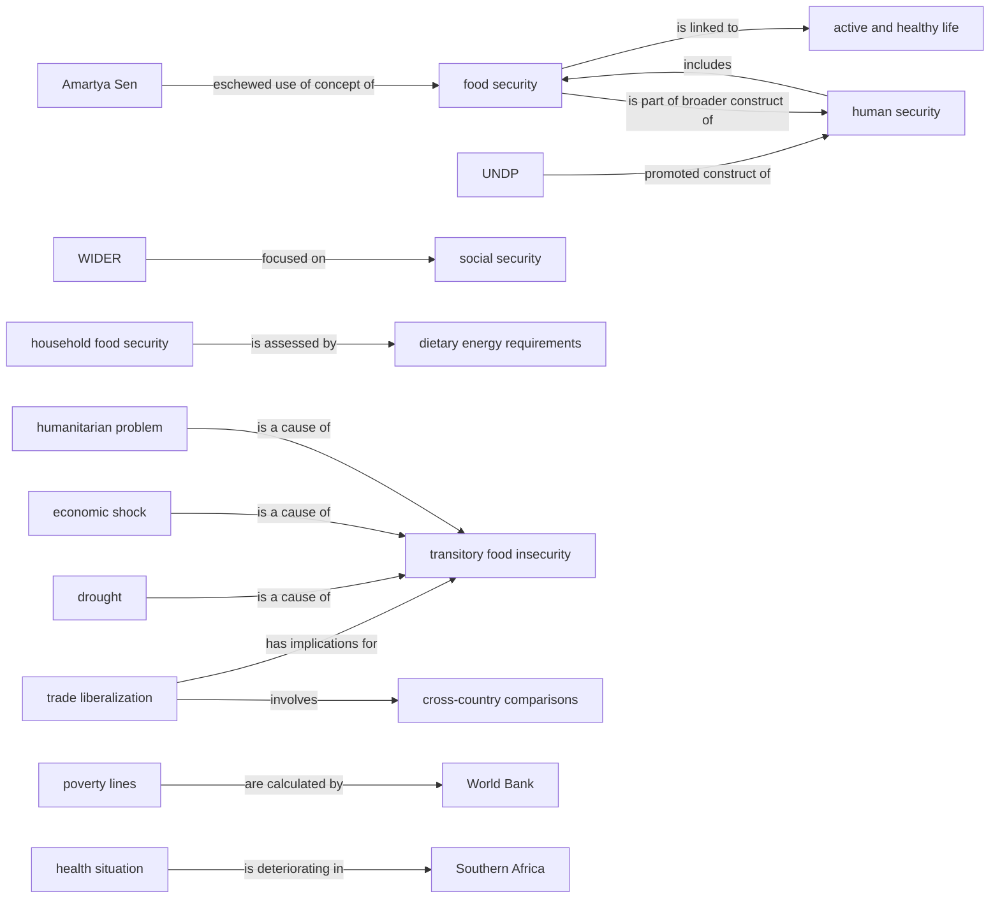

# Knowledge Graph for URL 5

**Source:** https://www.fao.org/3/y4671e/y4671e06.htm

**Status:**  Successfully Processed

**Entities Extracted:** 74

**Relations Found:** 113

```mermaid
flowchart LR
    Amartya_Sen["Amartya Sen"] -->|eschewed use of concept of| food_security["food security"]
    UNDP["UNDP"] -->|promoted construct of| human_security["human security"]
    human_security["human security"] -->|includes| food_security["food security"]
    WIDER["WIDER"] -->|focused on| social_security["social security"]
    food_security["food security"] -->|is part of broader construct of| human_security["human security"]
    household_food_security["household food security"] -->|is assessed by| dietary_energy_requirements["dietary energy requirements"]
    trade_liberalization["trade liberalization"] -->|has implications for| transitory_food_insecurity["transitory food insecurity"]
    trade_liberalization["trade liberalization"] -->|involves| cross_country_comparisons["cross-country comparisons"]
    food_security["food security"] -->|is linked to| active_and_healthy_life["active and healthy life"]
    poverty_lines["poverty lines"] -->|are calculated by| World_Bank["World Bank"]
    health_situation["health situation"] -->|is deteriorating in| Southern_Africa["Southern Africa"]
    drought["drought"] -->|is a cause of| transitory_food_insecurity["transitory food insecurity"]
    economic_shock["economic shock"] -->|is a cause of| transitory_food_insecurity["transitory food insecurity"]
    humanitarian_problem["humanitarian problem"] -->|is a cause of| transitory_food_insecurity["transitory food insecurity"]
```
