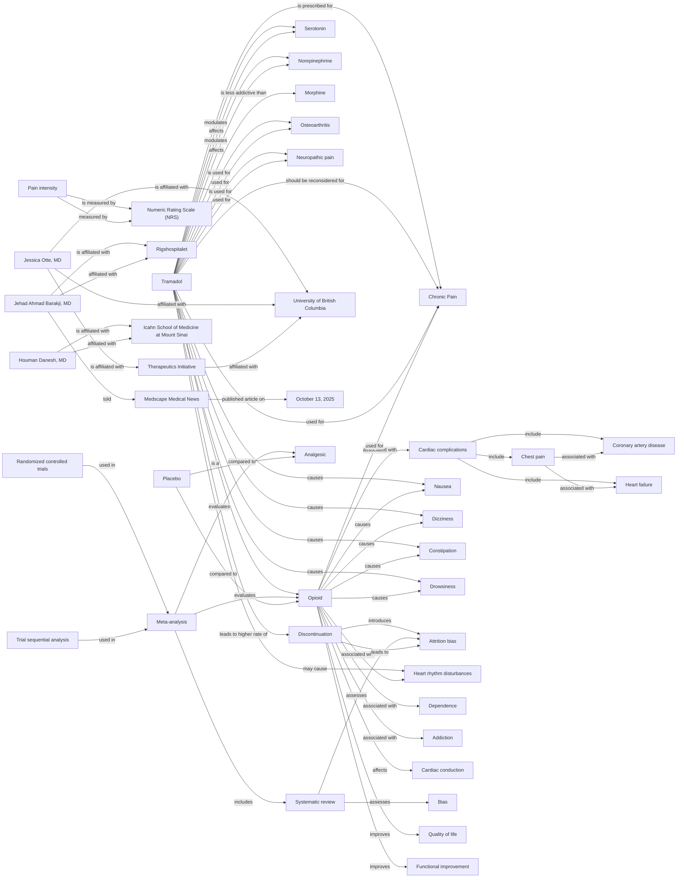

# Knowledge Graph for URL 6

**Source:** https://www.medscape.com/viewarticle/time-reconsider-tramadol-chronic-pain-2025a1000ria

**Status:**  Successfully Processed

**Entities Extracted:** 44

**Relations Found:** 107

