# Knowledge Graph for URL 8

**Source:** https://www.frontiersin.org/news/2025/09/01/rectangle-telescope-finding-habitable-planets

**Status:**  Successfully Processed

**Entities Extracted:** 48

**Relations Found:** 80

```mermaid
flowchart LR
    Heidi_Newberg["Heidi Newberg"] -->|is an| astrophysicist["astrophysicist"]
    Heidi_Newberg["Heidi Newberg"] -->|is affiliated with| Rensselaer_Polytechnic_Institute["Rensselaer Polytechnic Institute"]
    Heidi_Newberg["Heidi Newberg"] -->|published a paper in| Frontiers_in_Astronomy_and_Space_Sciences["Frontiers in Astronomy and Space Sciences"]
    Heidi_Newberg["Heidi Newberg"] -->|research focuses on| galaxy_structure["galaxy structure"]
    Heidi_Newberg["Heidi Newberg"] -->|research focuses on| habitable_worlds["habitable worlds"]
    telescope["telescope"] -->|has a| rectangular_mirror["rectangular mirror"]
    rectangular_space_telescope["rectangular space telescope"] -->|is modeled after| Diffractive_Interfero_Coronagraph_Exoplanet_Resolver["Diffractive Interfero Coronagraph Exoplanet Resolver"]
    rectangular_space_telescope["rectangular space telescope"] -->|is modeled after| James_Webb_Space_Telescope["James Webb Space Telescope"]
    James_Webb_Space_Telescope["James Webb Space Telescope"] -->|has diameter| 6.5_meters["6.5 meters"]
    Earth_like_exoplanet["Earth-like exoplanet"] -->|requires| liquid_water["liquid water"]
    liquid_water["liquid water"] -->|enables| chemical_reactions["chemical reactions"]
    sun_like_stars["sun-like stars"] -->|are long-lived enough for| multicellular_life["multicellular life"]
    sun_like_stars["sun-like stars"] -->|are within| 30_light_years["30 light-years"]
    Earth_like_exoplanet["Earth-like exoplanet"] -->|orbits| sun_like_stars["sun-like stars"]
    Earth_like_exoplanet["Earth-like exoplanet"] -->|has size and temperature similar to| Earth["Earth"]
    optics_theory["optics theory"] -->|determines resolution based on| wavelength["wavelength"]
    telescope["telescope"] -->|needs to collect light over| 20_meters["20 meters"]
    telescope["telescope"] -->|must be in| space["space"]
    infrared["infrared"] -->|has wavelength of| 10_microns["10 microns"]
    10_microns["10 microns"] -->|is optimal for detecting| liquid_water["liquid water"]
    visible_light["visible light"] -->|has star more than 10 billion times b...| Earth["Earth"]
    rectangular_mirror["rectangular mirror"] -->|can separate star from exoplanet in d...| 20_meters["20 meters"]
    rectangular_space_telescope["rectangular space telescope"] -->|avoids need for| starshade["starshade"]
    follow_up_study["follow-up study"] -->|could identify| atmosphere["atmosphere"]
    oxygen["oxygen"] -->|can be formed through| photosynthesis["photosynthesis"]
    sister_planet["sister planet"] -->|is also called| Earth_2.0["Earth 2.0"]
    multicellular_life["multicellular life"] -->|took roughly three billion years to f...| Earth["Earth"]
    human_life["human life"] -->|has existed for less than one 10 thou...| Earth["Earth"]
    single_celled_life["single-celled life"] -->|has existed almost as long as| Earth["Earth"]
    James_Webb_Space_Telescope["James Webb Space Telescope"] -->|has mirror diameter of| 6.5_meters["6.5 meters"]
    James_Webb_Space_Telescope["James Webb Space Telescope"] -->|operates in| infrared["infrared"]
    Diffractive_Interfero_Coronagraph_Exoplanet_Resolver["Diffractive Interfero Coronagraph Exoplanet Resolver"] -->|is a| rectangular_space_telescope["rectangular space telescope"]
    Diffractive_Interfero_Coronagraph_Exoplanet_Resolver["Diffractive Interfero Coronagraph Exoplanet Resolver"] -->|has mirror size of| 20_meters["20 meters"]
    Diffractive_Interfero_Coronagraph_Exoplanet_Resolver["Diffractive Interfero Coronagraph Exoplanet Resolver"] -->|capable of detecting wavelengths of| 10_microns["10 microns"]
    Heidi_Newberg["Heidi Newberg"] -->|is an| astrophysicist["astrophysicist"]
    Heidi_Newberg["Heidi Newberg"] -->|affiliated with| Rensselaer_Polytechnic_Institute["Rensselaer Polytechnic Institute"]
    Heidi_Newberg["Heidi Newberg"] -->|researches| galaxy_structure["galaxy structure"]
    space_telescope["space telescope"] -->|uses| starshade["starshade"]
    starshade["starshade"] -->|blocks light from| sun["sun"]
    starshade["starshade"] -->|improves detection of| exoplanet["exoplanet"]
    exoplanet["exoplanet"] -->|may have| atmosphere["atmosphere"]
    atmosphere["atmosphere"] -->|may contain| oxygen["oxygen"]
    oxygen["oxygen"] -->|may indicate| photosynthesis["photosynthesis"]
    photosynthesis["photosynthesis"] -->|supports| multicellular_life["multicellular life"]
    Earth_like_exoplanet["Earth-like exoplanet"] -->|orbits| sun_like_stars["sun-like stars"]
    space_observatory["space observatory"] -->|used for| follow_up_study["follow-up study"]
    space_telescope["space telescope"] -->|has| resolution["resolution"]
    resolution["resolution"] -->|limited by| atmosphere_blur["atmosphere blur"]
    rectangular_space_telescope["rectangular space telescope"] -->|based on| optics_theory["optics theory"]
    rectangular_space_telescope["rectangular space telescope"] -->|involves| engineering["engineering"]
    rectangular_space_telescope["rectangular space telescope"] -->|requires| optimization["optimization"]
    Earth["Earth"] -->|is a| sister_planet["sister planet"]
    Earth["Earth"] -->|supports| human_life["human life"]
    Earth["Earth"] -->|supports| single_celled_life["single-celled life"]
    Earth["Earth"] -->|supports| multicellular_life["multicellular life"]
    chemical_reactions["chemical reactions"] -->|occur in| atmosphere["atmosphere"]
    visible_light["visible light"] -->|has shorter wavelength than| infrared["infrared"]
    space_telescope["space telescope"] -->|detects| visible_light["visible light"]
    space_telescope["space telescope"] -->|detects| infrared["infrared"]
    exoplanet["exoplanet"] -->|located within| 30_light_years["30 light-years"]
```

