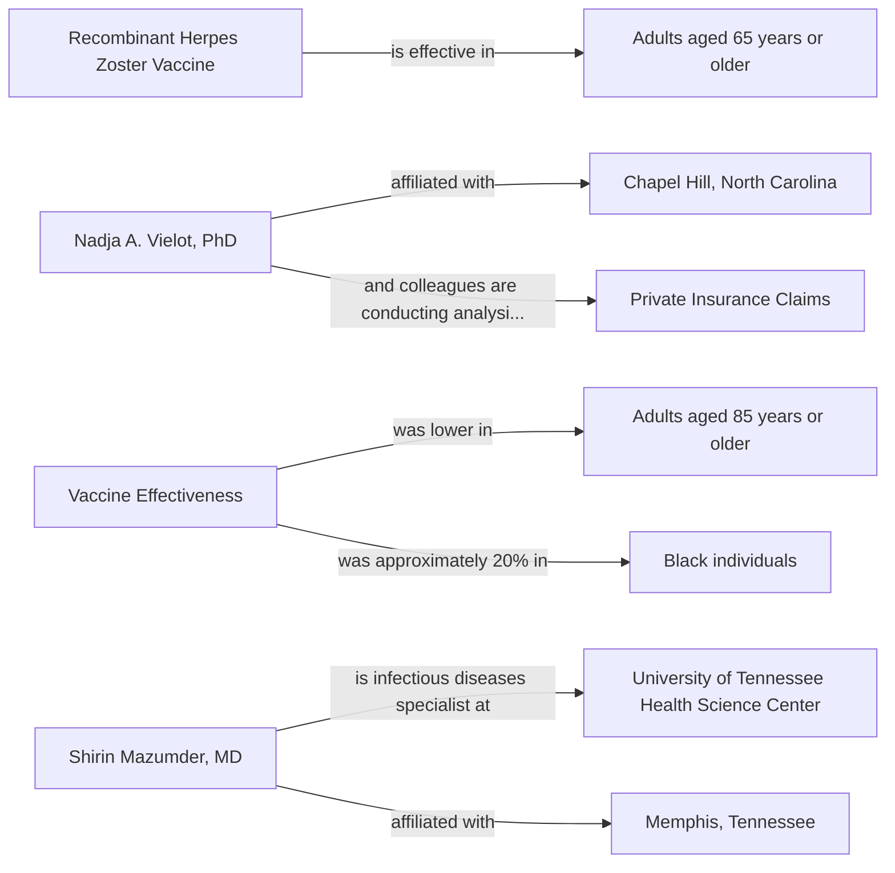

# Knowledge Graph for URL 9

**Source:** https://www.medscape.com/viewarticle/second-dose-boosts-shingles-protection-adults-aged-65-years-2025a1000ro7

**Status:**  Successfully Processed

**Entities Extracted:** 40

**Relations Found:** 42

